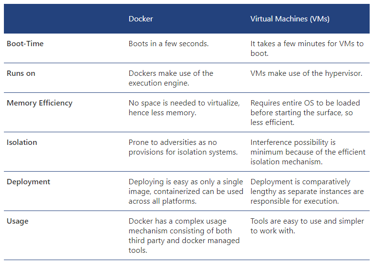
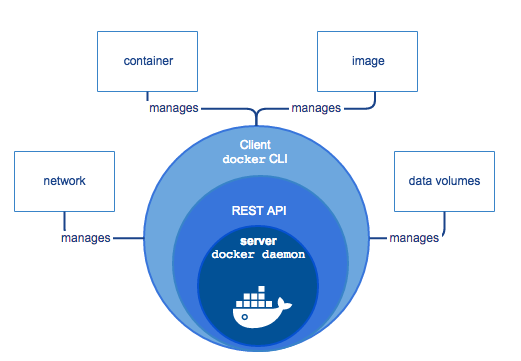

---

  

title: Docker

  

description: Docker

  

---
### Exploring Docker
---

**What is Docker**
****
 Docker is a software development tool and a virtualization technology that makes it easy to develop, deploy, and manage applications by using containers.
 
Container refers to a lightweight, stand-alone, executable package of a piece of software that contains all the libraries, configuration files, dependencies, and other necessary parts to operate the application.
****
- **Difference between Docker and Virtual Machine**

    - One of the popular approaches for running an application is over a virtual machine (VM). VMs run applications inside a guest operating system, which runs on virtual hardware powered by the server’s host OS.

    - 

    - Containers have a different approach to running applications. Containers do not include an operating system. Containers package the application binaries, utilize a host’s operating system, and share relevant libraries and resources as necessary to run applications.

    -  Table: Docker Vs Virtual Machines*

  

    - 

  

****

  

- **Why Containers ?**

    Containers provide the following benefits
    - Reduced IT management resources

    - Reduced size of snapshots

    - Quicker spinning up apps

    - Reduced and simplified security updates

    - Less code to transfer, migrate, and upload workloads

    Unlike virtual machines, containers do not have high overhead and hence enable more efficient usage of the underlying system and resources.

    FThe isolation and security aspects of Docker allow many containers to be run simultaneously on a given host. Once packaged, containers can be shipped and run anywhere.

****
**Docker Architecture**
****

Docker consists of a Docker Engine, which is a client server application. It contains the following components:

- A server, which is a type of long-running program called a "daemon process". The daemon creates and manages Docker objects, such as images, containers, networks and volumes.

- A REST API, which specifies interfaces that programs can use to talk to the daemon and give it instructions.

- A command line interface (CLI) client (the Docker command line).

- The Docker client talks to the Docker daemon, which does the heavy lifting of building, running and distributing Docker containers.

- When a Docker command such as *docker run* is executed, the client passes on this command to the daemon process, which in turn carries them out.

Now let's understand container and Images briefly:

- Containers allow the packaging of your application (and everything that you need to run it) in a “container image”. Inside a container you can include a base operating system, libraries, files and folders, environment variables, volume mount-points, and your application binaries.

- A “container image” is a template for the execution of a container — It means that you can have multiple containers running from the same image, all sharing the same behavior, which promotes the scaling and distribution of the application. These images can be stored in a remote registry to ease the distribution.

***
 ***Docker repository***
****
A ***Docker repository*** is where you can store 1 or more versions of a specific Docker image. An image can have 1 or more versions (tags).

***Docker images*** are read-only templates that are used to create Docker containers. Docker enables you to create new images, update existing images, or download images that others created. Docker images are the build component of Docker.
****

A ***Docker image*** can be compared to a git repo. A git repo can be hosted inside of a GitHub repository, but it could also be hosted on Gitlab, BitBucket or your own git repo hosting service. It could also sit on your development box and not be hosted anywhere.

The same goes for a Docker image. You can choose to not push it anywhere, but you could also push it to the Docker Hub which is both a public and private service for hosting Docker repositories. There are other third party repository hosting services too.

The thing to remember here is a Docker repository is a place for you to publish and access your Docker images. Just like GitHub is a place for you to publish and access your git repos.

It’s also worth pointing out that the Docker Hub and other third party repository hosting services are called “registries”. A registry stores a collection of repositories.

You could say a registry has many repositories and a repository has many different versions of the same image which are individually versioned with tags.
****

#### Types of Container Registries

There are lots of container registries out there. They can be broken down into several distinct categories:

- **Cloud-based registries:** Registries that are hosted in the public cloud by a third-party provider, such as Docker Hub.
    
- **On-premises registries:** Registries that you can install on your own infrastructure. You can create an on-premises registry manually using Docker, via Docker Registry (which is distinct from Docker Hub) or using a third-party registry like Quay.

- **Public registries:** Registries that anyone can access. Docker Hub is an example. So is Quay.io, a hosted public registry that is built using Quay. (To be clear, you can install Quay itself on your infrastructure; Quay.io is a hosted implementation of Quay designed for public access.)

- **Private registries:** Registries that require permissions in order to upload or download container images. You can create private registries using a service like Docker Hub, even though many Docker Hub registries are publicly accessible.

****
#### Commonly used registries:

- **Quay.io:**
Red Hat® Quay container and application registry provides secure storage, distribution, and deployment of containers on any infrastructure. It is available as an add-on for OpenShift or as a standalone component.

- **Docker hub:**
Docker Hub is the world’s largest repository of container images with an array of content sources including container community developers, open source projects and independent software vendors (ISV) building and distributing their code in containers. Users get access to free public repositories for storing and sharing images or can choose subscription plan for private repos.

- **Redhat Catalog:**
Mission-critical applications require trusted containers. Container images available from the Red Hat Ecosystem Catalog are built from base images that have been vetted by Red Hat’s internal security team and hardened against security flaws. Use the Red Hat Container Catalog (RHCC) to find container images that have been tested, secured, and verified by Red Hat.
****
**Docker Base Images**
****

A ****base image**** is the image that is used to create all of your container images. 
Your base image can be an official Docker image, such as Centos, or you can modify an official Docker image to suit your needs, or you can create your own base image from scratch.
****

The Docker Official Images are a curated set of Docker repositories hosted on Docker Hub. They are designed to:

 - Provide essential base OS repositories (for example, ubuntu, centos) that serve as the starting point for the majority of users.

 - Provide drop-in solutions for popular programming language runtimes, data stores, and other services, similar to what a Platform as a Service (PAAS) would offer.

 - Exemplify Dockerfile best practices and provide clear documentation to serve as a reference for other Dockerfile authors.

 - Ensure that security updates are applied in a timely manner. This is particularly important as many Official Images are some of the most popular on Docker Hub.

Docker, Inc. sponsors a dedicated team that is responsible for reviewing and publishing all content in the Official Images. This team works in collaboration with upstream software maintainers, security experts, and the broader Docker community.

****
***In the upcoming section "Use Red Hat Universal Base Images" , you will learn about different Red Hat based rhel/ubi base images and advantages of using them to create your application containers.***
****
